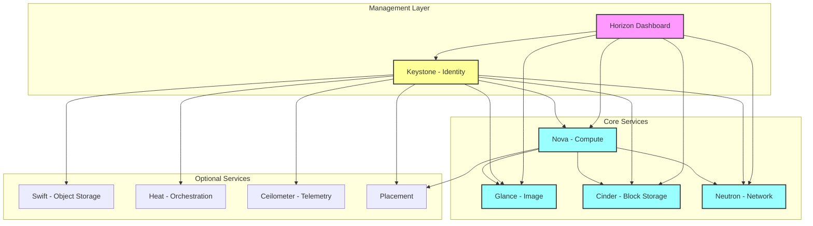

# OpenStack
- at least 64GB RAM
- at least 4 CPU cores
- at least 100GB disk space

# Installation
https://docs.openstack.org/devstack/latest/

Note: This diagram shows:
1. Management Layer (Purple) - User interface and authentication
2. Core Services (Blue) - Essential OpenStack services
3. Optional Services (Default) - Additional functionality
4. All services authenticate through Keystone (Yellow)
5. Arrows indicate service dependencies

## Terminology
- **DevStack**: A set of scripts and utilities to quickly deploy an OpenStack environment.
- **OpenStack**: A cloud computing platform for public and private clouds.
- **Nova**: The compute service in OpenStack.      (Manages virtual machines and instances)
- **Neutron**: The networking service in OpenStack. (Manages networks, subnets, and routers) 
- **Cinder**: The block storage service in OpenStack. (Manages block storage volumes)
- **Glance**: The image service in OpenStack. (Manages virtual machine images)
- **Keystone**: The identity service in OpenStack. (Manages users, roles, and permissions)
- **Horizon**: The dashboard for managing OpenStack services. (Provides a web-based user interface)
- **OpenShift**: A container application platform based on Kubernetes, often used with OpenStack. (Provides a developer-friendly interface for deploying applications)
- **Heat**: The orchestration service in OpenStack.
- **Swift**: The object storage service in OpenStack.
- **Ceilometer**: The telemetry service in OpenStack.
- **Trove**: The database as a service in OpenStack.
- **Magnum**: The container orchestration service in OpenStack.
- **Ironic**: The bare metal provisioning service in OpenStack.
- **Octavia**: The load balancing service in OpenStack.
- **Barbican**: The key management service in OpenStack.
- **Designate**: The DNS service in OpenStack.
- **Zaqar**: The messaging service in OpenStack.
- **Manila**: The shared file system service in OpenStack.
- **Senlin**: The clustering service in OpenStack.
- **Aodh**: The alarm service in OpenStack.
- **Panko**: The event service in OpenStack.
- **Tacker**: The NFV orchestration service in OpenStack.
- **Vitrage**: The root cause analysis service in OpenStack.
- **Mistral**: The workflow service in OpenStack.
- **Congress**: The policy engine in OpenStack.
- **Cyborg**: The hardware acceleration service in OpenStack.
- **Placement**: The resource tracking and scheduling service in OpenStack.
- **Zun**: The container service in OpenStack.
- **Kolla**: The containerized OpenStack deployment service.
- **Kolla-Ansible**: The Ansible-based deployment tool for OpenStack.
- **OpenStack CLI**: The command-line interface for managing OpenStack services.
- **OpenStack SDK**: The software development kit for interacting with OpenStack services programmatically.
- **OpenStack API**: The application programming interface for accessing OpenStack services.
- **OpenStack Dashboard**: The web-based interface for managing OpenStack services.
- **OpenStack Heat Orchestration Template (HOT)**: A template format for defining OpenStack resources and their relationships.
- **OpenStack Orchestration**: The service for managing the lifecycle of OpenStack resources.
- **OpenStack Telemetry**: The service for collecting and storing metrics and events from OpenStack services.
- **OpenStack Networking**: The service for managing networks and IP addresses in OpenStack.
- **OpenStack Block Storage**: The service for managing block storage volumes in OpenStack.
- **OpenStack Object Storage**: The service for managing object storage in OpenStack.
- **OpenStack Image Service**: The service for managing virtual machine images in OpenStack.
- **OpenStack Identity Service**: The service for managing users, roles, and permissions in OpenStack.
- **OpenStack Compute Service**: The service for managing virtual machines in OpenStack.
- **OpenStack Shared File Systems**: The service for managing shared file systems in OpenStack.
- **OpenStack Bare Metal Service**: The service for managing bare metal servers in OpenStack.