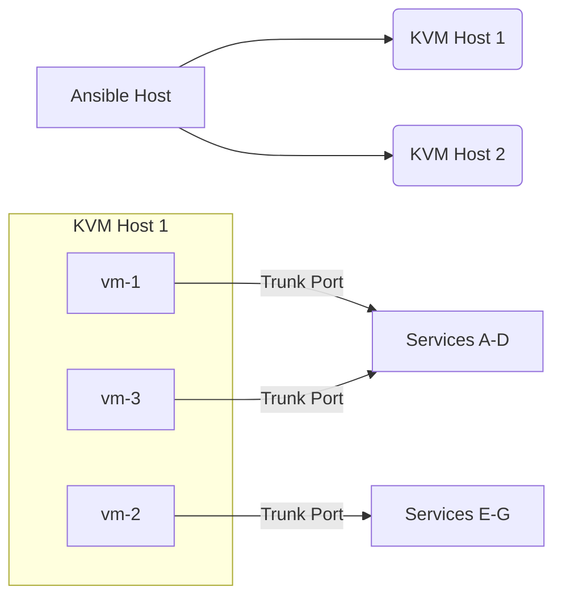

# Mini-2

## 1 Installation
### 1.1 Install Ansible

#### Setup ansible

##### 1.1.1 Create a ssh key in Mini-2
```shell
    # generate ssh key (-C for comment)
    $ ssh-keygen -t ed25519 -C ansible   (or with -f .ssh/ansible)

    # copy key to target server(s)
    $ ssh-copy-id -i id_ed25519.pub <kvm>@<ip-address>

    # install ansible
    $ apt install ansible

    # install python packages
    $ apt install -y python3 python3-pip python3-venv python3-dev build-essential 
    $ python3 -m venv venv3
    $ source venv3/bin/activate
    $ pip install -Iv resolvelib
    $ sudo ansible-galaxy collection install community.libvirt
```

##### 1.1.2 Setup ansible in Mini-2
```shell
    # Go to mini-2 and create an "ansible" folder
    $ mkdir ~/ansible
    
    # Copy ansible structure here to mini-2
    $ tar cvf ansible.tgz ansible
    $ scp ansible.tgz mini2:~

    # Extract ansible.tgz on mini-2
    $ tar xvf ansible.tgz
```

##### 1.1.3 Check to see if ansible works

```shell
    # ping all servers listed in inventory  (-m is module)
    $ ansible all --key-file ~/.ssh/id_ed25519 -i inventory -m ping
    or
    $ ansible all -i inventory -m ping # if ssh keyless was created
```


### 1.2 Install Docker and Dependencies
- Get containers so ansible can deploy containers on VMs offline
```
    1. run "./scripts/setup_docker.sh"          # setup docker on local machine
    2. run "./scripts/get_containers.sh"        # download containers to install on VMs later
    3. run "./copy_keys.sh"                     # add public key so we can connect to VMs using passwordless
```


## 2. Topology Diagram


Note: each VM can bridge to one or more vlans.  A vlan represents a zone where VMs can reach their needed services

## 3. Vlan Segments

```text
# VLANs that VMs will be using
--------------------------------------------------------------
VLAN-10: Internal network (e.g. development)
VLAN-20: Secure network (e.g. database)
VLAN-30: Tenant network (e.g. tenant DHCP)
VLAN-40: Provider Infra network (e.g. DHCP, DNS, NTP, netbox)
VLAN-100: Public network (e.g. AWS, Vault)

# Note: need to create Bridges for VLANs in KVM so VMs can use
```

